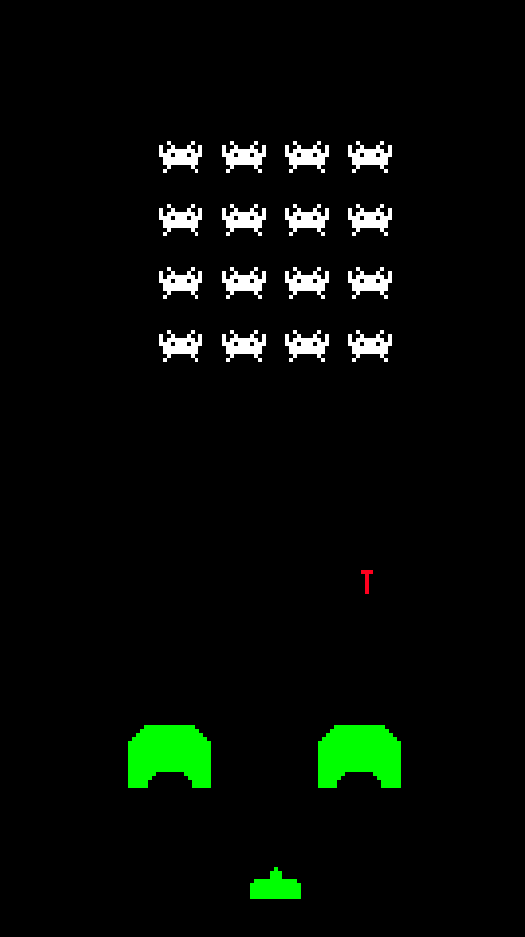
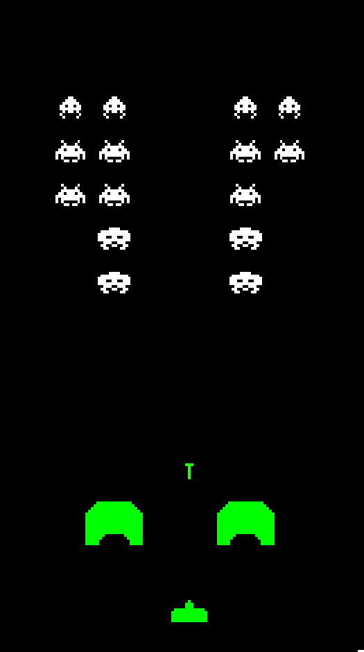

# Space Invaders

---

### Table of Contents

- [Description](#description)
- [How To Play](#how-to-Play)
- [Learned](#learned)
- [Author Info](#author-info)

---

## Description
Player has to destroy wave of enemies while avoiding their projectiles while not letting them arrive to certain point. Bunkers allow player to hide from enemy projectiles. After every invader death the whole group gains:
- Attack speed
- Movement speed 

---

## How To Play
> A move space ship to the left | D move space ship to the Right

> Shoot projectiles at enemies with space 

---

## Learned
- Use of layers in code
- Simple animation
- Difficulty level ramp up
- Enemy movement
- 2D projectiles
- How to do custom number of enemies

---

## Author Info

- Twitter - [@MarceliKumiers1](https://twitter.com/MarceliKumiers1)
- LinkedIn - [Marceli Kuśmierski](https://www.linkedin.com/in/marceli-ku%C5%9Bmierski-321969165/)

[Back To The Top](#Space-Invaders)
